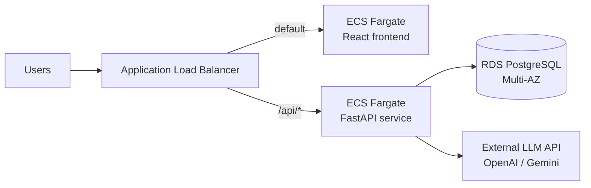

# AWS Deployment Guide

A scalable production deployment approach for chatBotDrinkRecommendation.

## Architecture overview

## Components

### 1. Frontend — ECS Fargate (nginx)
- The `frontend/` nginx image serves the built React app behind the ALB (default listener action); `/api/*` routes to the backend target group.
- Matches the Terraform in [terraform/](terraform/). Alternative for lower cost at scale: S3 + CloudFront with an ALB origin for `/api/*`.

### 2. Backend API — ECS Fargate
- Push the `backend/` image to ECR.
- Run as an ECS Fargate service behind an **Application Load Balancer** (health check: `GET /api/health`).
- Auto scaling on CPU/request count (e.g., 2 min tasks → 10 max).
- Run DB migrations as a one-off ECS task (`alembic upgrade head`) in the deploy pipeline, **not** in the container entrypoint, to avoid concurrent migration races.
- Store secrets (`JWT_SECRET`, DB credentials) in **AWS Secrets Manager** / SSM Parameter Store, injected via the task definition.

### 3. Database — RDS PostgreSQL
- RDS PostgreSQL (Multi-AZ for HA), in private subnets, accessible only from the ECS security group.
- Enable automated backups and point-in-time recovery.
- Use RDS Proxy if task counts grow to keep connection counts under control.

### 4. LLM — external API (no LLM infrastructure)

The app calls a hosted LLM API (OpenAI or Gemini) selected via `LLM_PROVIDER`:
- No GPU instances to run or scale; pay per token; scales to zero.
- The API key is stored in **Secrets Manager** and injected into the ECS task.
- Backend tasks reach the provider over the NAT gateway (no inbound exposure).
- Ollama remains available for free local development only.

### 5. Networking & security
- VPC with public subnets (ALB) and private subnets (ECS tasks, RDS).
- Security groups: ALB → ECS:8000/80; ECS → RDS:5432 only; LLM traffic is outbound-only via NAT.
- HTTPS via ACM certificate on the ALB/CloudFront; redirect HTTP → HTTPS.
- WAF on CloudFront/ALB for rate limiting the chat endpoint (LLM calls are expensive).
- Set a strong `ADMIN_API_KEY`; consider moving admin endpoints behind IAM/SSO for production.

### 6. Observability
- CloudWatch Logs for ECS containers (structured JSON logging).
- CloudWatch alarms: ALB 5xx rate, target response time, RDS CPU/connections, LLM API error rate/latency (from app logs).
- Optionally X-Ray or OpenTelemetry for tracing chat-request → LLM latency.

## CI/CD sketch

1. GitHub Actions: on push to `main` — run `pytest`, build backend + frontend images, push to ECR.
2. Run migration task (`alembic upgrade head`) against RDS.
3. Update ECS service (rolling deploy); sync frontend `dist/` to S3 + CloudFront invalidation.

## Cost-conscious starting point

| Resource | Size | Approx. |
|---|---|---|
| ECS Fargate | 2 × 0.5 vCPU / 1 GB | ~$30/mo |
| RDS Postgres | db.t4g.small Multi-AZ | ~$50/mo |
| LLM API (gpt-4o-mini / gemini-2.0-flash) | pay per token | usage-based |
| NAT gateway | single | ~$35/mo |

Watch LLM token spend first — add rate limiting (WAF) on the chat endpoint and cap `max_tokens` if costs grow.
